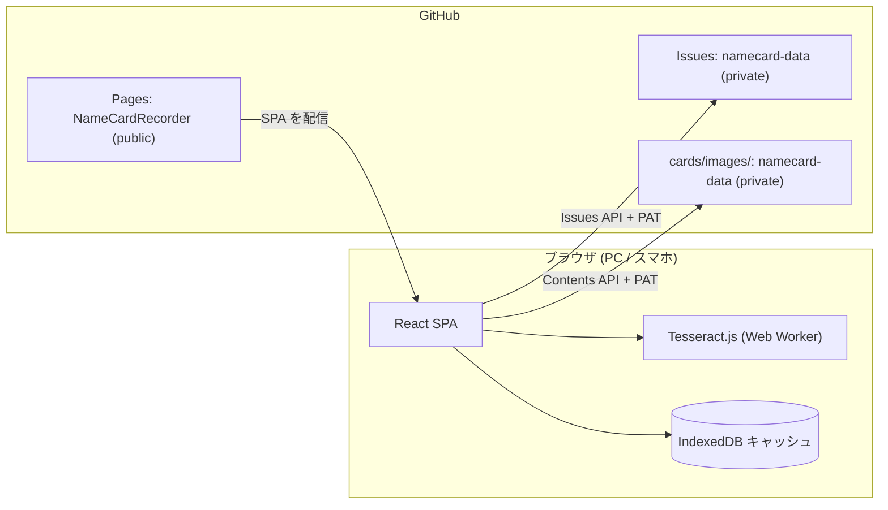
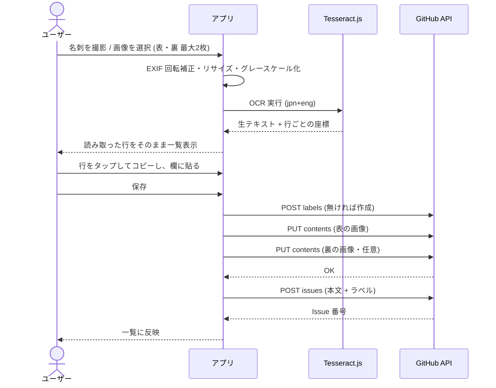

# アーキテクチャ

全体概要は [../README.md](../README.md)、機能と受け入れ条件は [spec.md](spec.md)、作業規約は [../AGENTS.md](../AGENTS.md)。

## 1. 全体構成

サーバーは持たない。ブラウザで動く SPA が、ユーザー自身のトークンで GitHub API を直接叩く。



| 要素 | 役割 |
|---|---|
| `NameCardRecorder`（public） | アプリのソースと GitHub Pages の配信元。**データは一切含まない** |
| `namecard-data`（private） | 名刺台帳。Issues がレコード、`cards/images/` が名刺画像 |
| PAT | `namecard-data` のみに絞った Fine-grained token。ブラウザの localStorage に保存 |

## 2. 主要な設計判断

| 判断 | 選択 | 理由 | 代替（不採用の理由） |
|---|---|---|---|
| データの置き場 | 別 private リポジトリの Issues | 無料の Pages は public リポジトリ限定。個人情報を public に置けない | 同一リポジトリ（データが公開されてしまう）／GitHub Pro で private Pages（有料） |
| 認証 | Fine-grained PAT を localStorage | サーバー不要で完全無料。個人利用なら十分 | OAuth App（トークン交換に別サーバーが必要）／Device Flow（GitHub のエンドポイントが CORS 非対応） |
| OCR | Tesseract.js（ブラウザ内） | API キー不要・無料・画像が外部に出ない | クラウド OCR / LLM（精度は高いが有料・キー管理が必要）→ Phase 2 で差し替え可能な形にする |
| 検索 | 全件を IndexedDB にキャッシュしてクライアント側で検索 | 数百件なら即応。オフラインでも一覧が見える。Search API のインデックス遅延を避けられる | GitHub Search API（新規 Issue が数秒〜数分ヒットしない・レート制限が別枠で厳しい） |
| 画像の保存 | `cards/images/` にコミットして Issue から参照 | 後から実物を見返せる。Git に履歴が残る | Issue への添付（API から不可）／保存しない（照合できない） |
| ルーティング | HashRouter | GitHub Pages は SPA のリライトができず、直リンクで 404 になる | BrowserRouter + 404.html ハック（挙動が読みにくい） |
| YAML の読み書き | 自前の最小実装（`src/lib/card/yaml.ts`） | 依存を増やさない規約に従う。扱うのは「1 階層・文字列だけ」で、必要なのは引用と復号のみ | `yaml` パッケージ（数十 KB の依存を、この用途のためだけに足すことになる） |
| デザイントークン | `tailwind.config.js` の `theme.colors` を**置き換え**、根拠を `DESIGN.md` に固定 | 既定の `gray-*` / `blue-*` を機械的に使えなくして、色のベタ書きを防ぐ | `extend` で足すだけ（既定色が併用でき、一貫性が崩れる） |
| 書体 | webfont を読み込まず system stack（ゴシック／明朝／等幅のロール分け） | 日本語 webfont は数 MB あり、Tesseract の言語データと重なるとスマホの初回起動が壊れる | Google Fonts の日本語書体（初回表示の性能要件に反する） |
| 画像の表示 | Contents API から `Accept: application/vnd.github.raw` で取得し object URL にする | データリポジトリは private なので、`?raw=true` の URL を `` に入れても認証が無く読めない | 本文の raw URL をそのまま使う（アプリ内では 404 になる） |
| 一覧の並び | 出会った日 → Issue 番号の降順 | 登録直後の 1 件が必ず先頭に来る（受け入れ条件） | `updated_at` 順（GitHub 側で古い名刺を編集すると先頭に来てしまう） |

### セキュリティ上の前提

- PAT は localStorage に平文で入る。**アプリのリポジトリを public にする以上、XSS を持ち込まないことが唯一の防壁**になる。`dangerouslySetInnerHTML` と、信頼できない文字列を DOM に流す実装を禁止する。
- トークンは `namecard-data` の Issues / Contents だけに絞る。漏れても被害範囲がそのリポジトリで止まる。
- 名刺データは第三者の個人情報。データ用リポジトリを public にしない、画像を外部サービスに送らない、ログに残さない。

## 3. データの持ち方

### 1 枚の名刺 = 1 Issue

- **タイトル**: `氏名 - 会社名`（例: `山田 太郎 - 株式会社サンプル`）。氏名が空なら `(氏名未入力) - 会社名`。
- **状態**: `open` = 現役、`closed` = アーカイブ（退職・不要）。削除はしない。
- **本文**: 先頭にスキーマ版のマーカー、続けて YAML ブロック。GitHub 上でも読めて、機械でも確実に読める形にする。

~~~markdown
<!-- namecard:v1 -->

```yaml
name: 山田 太郎
nameKana: やまだ たろう
company: 株式会社サンプル
department: 営業本部 第一営業部
title: 課長
email: taro.yamada@example.co.jp
phone: 03-1234-5678
mobile: 090-1234-5678
fax: 03-1234-5679
postalCode: 100-0001
address: 東京都千代田区千代田1-1-1 サンプルビル 8F
website: https://example.co.jp
metOn: 2026-09-08
metAt: 東京ビッグサイト / 展示会2026
image: cards/images/2026/20260908-013a.jpg
```

## メモ

新製品の件で再連絡する。

## 名刺画像


<details><summary>OCR 生テキスト</summary>

株式会社サンプル
営業本部 第一営業部 課長
山田 太郎
...

</details>
~~~

| フィールド | 型 | 必須 | 備考 |
|---|---|---|---|
| `name` | string | – | 氏名。空でも登録できる |
| `nameKana` | string | – | ふりがな |
| `company` | string | – | 会社名 |
| `department` | string | – | 部署 |
| `title` | string | – | 役職 |
| `email` / `website` | string | – | 形式チェックあり |
| `phone` / `mobile` / `fax` | string | – | 印字のまま保持（ハイフン含む） |
| `postalCode` / `address` | string | – | |
| `metOn` | `YYYY-MM-DD` | ✓ | 既定は登録日 |
| `metAt` | string | – | 場所・イベント名。`event:` ラベルの元にもなる |
| `image` | string | – | リポジトリ内の相対パス |
| `tags` | string | – | カンマ区切り（例: `tags: 要フォロー, 技術`）。`tag:` ラベルの元 |

**空の値は書かない**（`name: ""` ではなくキーごと省略）。パーサは欠けたキーを `undefined` として扱う。

#### 値の引用ルール（`src/lib/card/yaml.ts`）

住所・会社名にはコロン・記号・空白が普通に入る。**ここを緩めるとデータが静かに壊れる**ので、
次のいずれかに当てはまる値は必ず二重引用符で囲み、`\` `"` 改行をエスケープする。

- 空文字、前後に空白がある、改行・タブを含む
- `: ` を含む／`:` で終わる（`key: value` と誤読される）
- ` #` を含む（コメント開始と誤読される）
- `- ? : , [ ] { } # & * ! | > ' " % @ \`` のいずれかで始まる
- `true` / `false` / `null` / `yes` / `no` / `on` / `off` / `~`（真偽値・null と誤読される）
- 数値として読める（`2024` など）
- `\` を含む

読み取り側は**最初のコロンだけ**で分割する（`website: https://example.co.jp` を壊さないため）。

#### 後方互換

- 先頭に `<!-- namecard:v1 -->` を書くが、**マーカーが無くても・知らない版でも、YAML ブロックが読めれば読む**。
- 知らないキーは無視する（前方互換）。欠けたキーは空として扱う。
- スキーマを変えるときは、この「旧形式も読めるパーサを残す」方針を維持する。`tags` を後から足したときも、
  `tags` の無い旧 Issue はタグ無しとして読める形にしてある。

### ラベル

| ラベル | 用途 | 例 |
|---|---|---|
| `card` | 名刺 Issue の目印。**全件に必ず付ける** | `card` |
| `company:{会社名}` | 会社での絞り込み | `company:株式会社サンプル` |
| `event:{イベント名}` | もらった場面での絞り込み。**`metAt`（出会った場所）から作る** | `event:展示会2026` |
| `tag:{任意}` | 自由なタグ。`tags` から作る | `tag:要フォロー` |

ラベルは存在しなければ作成してから付ける（Issues API はラベル自動作成をしない）。作成時に GitHub が返す
422 / 409 は「既にある」として成功扱いにする。`card` 以外のラベルは検索の補助であり、正となる値は本文の YAML 側。
**表示・検索は YAML を正とし、ラベルはあくまで GitHub 上で使うための冗長化**とする
（アプリ内の一覧・検索・絞り込みは、ラベルを一切見ずに YAML だけで動く）。

タグにカンマは使えない（`tags` の 1 行表現で区切りと区別できなくなるため、入力時に空白へ置き換える）。

### 画像

- 保存先: `cards/images/{YYYY}/{YYYYMMDD}-{ランダム4文字}.jpg`
- クライアントで長辺 1600px にリサイズし JPEG 品質 0.8 で圧縮（目安 200–400KB）
- Contents API (`PUT /repos/{owner}/{repo}/contents/{path}`) に base64 でコミット
- 手順は **ラベル作成 → 画像コミット → Issue 作成**。
  - 画像は **Issue 作成より先**。画像が失敗したら Issue を作らず、ユーザーに再試行させる（本文だけ残って画像リンクが 404 になる状態を作らない）
  - ラベルは **画像より先**。逆順だと、ラベル作成が失敗したときに画像だけがコミットされ、再試行のたびに孤児の画像が増える
- コミットメッセージに氏名・会社名を入れない（個人情報を Git 履歴の見出しに残さない）
- **アプリ内での表示は Contents API 経由**。private リポジトリなので本文の `?raw=true` URL は
  `` では読めない。`Accept: application/vnd.github.raw` で取得して object URL にする
  （`src/components/CardImage.tsx`）。本文の raw URL は GitHub の画面で見るためのもの

## 4. GitHub API の使い方

| 操作 | エンドポイント |
|---|---|
| 一覧取得 | `GET /repos/{o}/{r}/issues?labels=card&state=all&per_page=100&sort=updated&direction=desc` |
| 差分取得 | 上に `&since={ISO8601}` を付ける（`updated_at` が基準） |
| 登録 | `POST /repos/{o}/{r}/issues` |
| 更新 | `PATCH /repos/{o}/{r}/issues/{number}` |
| 画像コミット | `PUT /repos/{o}/{r}/contents/{path}` |
| ラベル作成 | `POST /repos/{o}/{r}/labels`（409 は「既にある」として無視） |
| 接続確認 | `GET /repos/{o}/{r}`（設定画面の「接続テスト」） |

- ヘッダ: `Authorization: Bearer {PAT}` / `Accept: application/vnd.github+json` / `X-GitHub-Api-Version: 2022-11-28`
- **Pull Request は Issues API にも混ざる**ので、`pull_request` キーを持つものは除外する。
- レート制限（認証済み 5,000/時）は `x-ratelimit-remaining` を見て、残り少なければ同期を止めてユーザーに知らせる。
- 401 はトークン不正 → 設定画面へ誘導。404 はリポジトリ名違いか権限不足 → その旨を出す（両者を「エラー」で一括りにしない）。

### 同期とキャッシュ

```
起動 → IndexedDB から即座に一覧を描画（オフラインでも見える）
     → since=lastSyncedAt で差分だけ取得
     → 差分を IndexedDB にマージ、lastSyncedAt を更新、画面を更新
```

- 初回は全件をページネーションで取得する。
- 登録・更新の直後は、API のレスポンスをそのままキャッシュに反映する（再取得を待たない）。
- **`lastSyncedAt` はキャッシュへの書き込みが成功したときだけ進める。** 書けていないのに進めると、
  次回は差分しか取りに行かないのにキャッシュは空、という状態になり名刺が消えたように見える。
- キャッシュは「リポジトリ + トークンの持ち主」単位。設定でリポジトリを変えたらキャッシュを捨てる。

## 5. OCR パイプライン



### 前処理

`<canvas>` で、EXIF の向きを補正 → 長辺 1600px にリサイズ → グレースケール → コントラスト強調。Tesseract は小さすぎる文字と傾きに弱いので、**前処理をサボると精度が目に見えて落ちる**。

### 項目の振り分けはしない（方針転換）

**OCR の結果をどのフィールドに入れるかは推測しない。**読めた行をそのまま並べ、
ユーザーが**行ごとにタップしてコピー**し、必要な欄に貼る（`src/components/OcrTextPanel.tsx`）。

かつては氏名・会社名・部署・役職までを辞書とヒューリスティック（「文字の高さが最大の行が氏名」など）で
振り分けていたが、次の理由でやめた。

- **間違えたときのコストが、当たったときの利益より大きい。**空欄なら貼るだけで済むが、
  誤った値が入っていると「消してから貼る」の 2 手になる。しかも誤りに気づかず登録される危険がある。
- 日本語名刺のレイアウトは多様で、肩書きと部署、屋号と氏名の区別は印字だけからは決まらない。
  Tesseract の認識揺れが乗るとさらに不確かになる。
- `docs/spec.md` が元から掲げていた「**推測で誤った値を入れるより空の方がよい**」を突き詰めると、
  推測をやめるのが筋。

メール・電話番号のような正規表現で確実に取れる項目も、**一貫性のために自動入力しない**。
「たまに入っていて、たまに入っていない」ほうが操作を覚えにくいという判断。

生テキストは Issue 本文の details に表裏それぞれ残すので、後から検索・参照はできる。

#### 表示・コピー用の空白詰め（`src/lib/ocr/lines.ts`）

Tesseract は日本語で**文字と文字の間に空白を入れてくる**。架空の名刺で実測した例:

```
株式会社サンプル      → 株 式 会 社 サ ンプ ル
営業本部 第一営業部   → 営業 本 部 第 一 営業 部
```

このままコピーできても貼り先で直す羽目になり、行コピーの意味が薄れる。一方で
`山田 太郎` の姓名の区切りや `TEL 03-1234-5678` の空白は消してはいけない。そこで

- 空白区切りのトークンが**すべて CJK**で、かつ**過半数が 1 文字**の行だけ詰める
- それ以外の行は触らない

というルールにした。詰めるのは**表示とコピーだけ**で、Issue 本文の `ocrText` には
生テキストをそのまま残す（後から別の解釈をやり直せるようにするため）。

> 将来クラウド OCR や LLM に切り替えて精度が上がったら、振り分けを再導入する余地はある。
> そのときは `OcrProvider` の差し替え（下記）と合わせて `docs/spec.md` の受け入れ条件から見直すこと。

### 言語データの配信（未決定事項の決定）

`jpn`+`eng` の学習データ（10–15MB）は **tesseract.js の既定どおり CDN から取得**し、リポジトリに同梱しない。

- 同梱するとアプリのリポジトリと Pages の成果物が 15MB 太る。ブラウザにキャッシュされるので 2 回目以降は効かない。
- **画像は外に出ない。**送るのではなく、辞書を取ってきてブラウザ内で処理する（プライバシー前提は保たれる）。
- Tesseract 本体は動的 import にして初期表示のバンドルから外してある（`src/pages/NewCard.tsx`）。
- 初回だけ辞書のダウンロード時間が乗る。**`docs/spec.md` の OCR 所要時間（PC 10 秒／スマホ 20 秒）は
  辞書取得後の 2 回目以降を指す**ものとして扱う。

### 差し替え可能にしておく

将来クラウド OCR や LLM に切り替えられるよう、`OcrProvider` インタフェース（`recognize(image): Promise<OcrResult>`）を切り、Tesseract 実装をその 1 つとして置く。呼び出し側はインタフェースにだけ依存する。

実装済み: `src/lib/ocr/types.ts` に `OcrProvider`、`src/lib/ocr/tesseract.ts` に Tesseract 実装。
`NewCard` は props で provider を差し替えられる。

## 6. デプロイ

`.github/workflows/deploy.yml` で `main` への push をトリガーに `npm ci && npm run build` → `actions/deploy-pages`。

- Vite の `base` は `/NameCardRecorder/` に設定する（Pages のサブパス）。**後から変えるとアセットのパスが
  全部ズレる**ので、開発の最初から入れてある。
- ワークフローは公開前に `lint` → `typecheck` → `test --run` → `build` を回す。壊れたものを Pages に出さない。
- 公開されるのはアプリのコードだけ。ビルド成果物にトークンもデータも含まれない（含めないことを保つのが `AGENTS.md` の Do NOT）。

## 7. コードの置き場所

| 役割 | ファイル |
|---|---|
| GitHub API の入口（認証ヘッダ・ページネーション・エラー分類） | `src/lib/github/client.ts` / `errors.ts` |
| Issues の一覧・作成、PR 除外 | `src/lib/github/issues.ts` |
| Contents へのコミットと画像取得 | `src/lib/github/contents.ts` |
| ラベルの用意 | `src/lib/github/labels.ts` |
| 登録の流れ（画像 → ラベル → Issue） | `src/lib/github/createCard.ts` |
| Issue 本文の serialize / parse | `src/lib/card/serialize.ts` / `yaml.ts` |
| ラベルの組み立て | `src/lib/card/labels.ts` |
| 保存前の検証 | `src/lib/card/validate.ts` |
| 読み取った文字の行コピー | `src/components/OcrTextPanel.tsx` / `src/lib/clipboard.ts` |
| 画像の前処理（EXIF・リサイズ・グレースケール） | `src/lib/ocr/image.ts` |
| 検索・絞り込み | `src/lib/search.ts` |
| 設定（localStorage・形式検証・マスク） | `src/lib/settings.ts` |
| キャッシュと同期 | `src/store/db.ts` / `useCards.ts` / `merge.ts` |
| 画面 | `src/pages/CardList.tsx` / `NewCard.tsx` / `CardDetail.tsx` / `Settings.tsx` |
| デザイントークンの根拠 | `../DESIGN.md`（値は `../tailwind.config.js`） |
