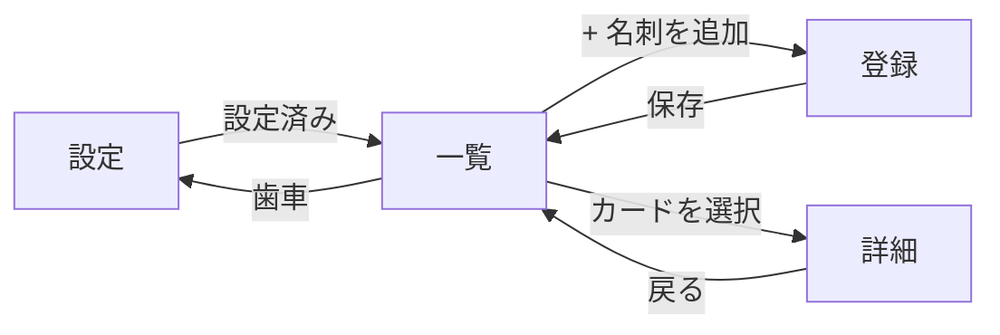

# NameCardRecorder 仕様書

> **ステータス**: 確定（MVP スコープ）・**作成日**: 2026-09-08
> **読者**: 実装するエージェント。背景は [../README.md](../README.md)、作業規約は [../AGENTS.md](../AGENTS.md)、構成・データ設計は [architecture.md](architecture.md)。

実装の**契約書**。各機能の「受け入れ条件」が合格ラインで、AGENTS.md の検証ループで照合する。仕様を変えたら同期規約に従いこのファイルと関連 docs を更新する。

---

## 1. 概要

- **一言コンセプト**: 名刺を撮るだけで、自分の private な GitHub リポジトリの Issues に台帳が貯まる名刺管理アプリ。
- **ターゲット**: 自分ひとり（個人の名刺管理）。GitHub アカウントを持っていることが前提。
- **想定規模**: 名刺 500 枚程度まで快適に動けばよい。

> 詳しい背景は ../README.md。

## 2. 機能一覧

### ✅ MVP

#### 機能0：初期設定（データリポジトリと認証）

アプリを開いて最初にやること。ここが通らないと何もできないので最初に作る。

- [x] 設定が未入力の状態でアプリを開くと、設定画面に自動で遷移する
- [x] 「データリポジトリ（`owner/repo` 形式）」と「アクセストークン」を入力して保存できる
- [x] `owner/repo` の形式でない文字列を保存しようとすると、`owner/repo の形式で入力してください` と表示され保存されない
- [x] 「接続テスト」ボタンで `GET /repos/{owner}/{repo}` を叩き、成功すると `接続できました` と表示される
- [x] トークンが無効（401）のとき `トークンが無効です` と表示される
- [x] リポジトリが存在しない／権限が足りない（404）のとき `リポジトリが見つかりません。名前とトークンの権限を確認してください` と表示される（401 と別のメッセージであること）
- [x] 保存後にブラウザを再読み込みしても設定が保持されている（localStorage）
- [x] 「設定を消去」でトークン・リポジトリ設定・ローカルキャッシュがすべて消え、設定画面に戻る
- [x] 設定画面上でトークンはマスク表示（`ghp_****…`）され、平文では表示されない
- [x] トークンの値が `console` の出力や DOM の属性に一切現れない
- [x] Google Cloud Vision の API キーを任意で設定でき、入れると OCR がそちらに切り替わる
- [x] キーを入れる場所に、**画像が Google に送信されること**と課金が起きうることが明記されている
- [x] 保存済みの API キーもマスク表示され、平文でも DOM の属性にも現れない
- [x] 「キーを消す」でブラウザ内 OCR に戻せる（リポジトリ・トークンの設定は消えない）

#### 機能1：名刺の取り込みと OCR

- [ ] 「+ 名刺を追加」から、カメラ撮影（スマホ）と画像ファイル選択（PC）の両方で画像を読み込める
- [x] 名刺の画像を**表・裏の 2 枚まで**選べる（裏は任意。表だけでも登録できる）
- [x] 画面に出るのは常に片面だけで、**カードを押すと裏返る**（「裏を見る／表を見る」からも切り替えられる）
- [x] 裏返さなくても、表・裏それぞれ画像を選んだかどうかが分かる
- [x] 選んだ画像を面ごとに外して選び直せる
- [ ] スマホの縦持ちで撮った写真が、横倒しにならず正しい向きで表示される（EXIF 補正）
- [x] 画像を読み込むと OCR の進捗（%）が表示され、処理中は保存ボタンが押せない
- [x] OCR 中も画面が固まらない（Web Worker で実行されている）
- [ ] 標準的な日本語名刺の OCR が、**画像 1 枚あたり** PC で 10 秒以内・スマホで 20 秒以内に終わる（2 枚選んだ場合は 1 枚ずつ順に読み取る）
      → **PC は確認済み**（初回 7.7 秒 / 2 回目 4.2 秒）。**スマホは未確認**
- [ ] JPEG / PNG / HEIC のいずれでも読み込める（HEIC が不可の環境では `この形式の画像は読み込めません` と表示する）
- [x] 画像以外のファイルを選ぶと `画像ファイルを選んでください` と表示され、OCR は始まらない

#### 機能2：確認フォームと登録

抽出結果は必ず人が直せる。**OCR の精度そのものは受け入れ条件にしない**（Tesseract の限界があるため）。判定するのは「印字されている情報が正しくフィールドに振り分けられるか」の機械的な部分に絞る。

- [x] OCR 完了後、氏名・ふりがな・会社名・部署・役職・メール・電話・携帯・FAX・郵便番号・住所・Web サイト・出会った日・出会った場所・メモ・タグの入力欄を持つフォームが表示される
- [x] OCR テキストにメールアドレスが含まれていれば `email` 欄に入る（[抽出ルール](architecture.md#項目抽出srclibocrparser)に従う）
- [x] `TEL 03-1234-5678` と `FAX 03-1234-5679` が別々の欄に入る
- [x] `090-` で始まる番号は「携帯」欄に入る
- [x] `株式会社` を含む行が会社名欄に入る
- [x] 日本語が文字単位にばらけて読まれた行（`株 式 会 社 …`）でも抽出できる。ただし `山田 太郎` の姓名の区切りや `TEL 03-…` の空白は残す
- [x] 読み取った行が**名刺画像の上のその位置に重ねて**表示される（表示サイズが変わっても位置がずれない）
- [x] 重ねた行を押すと、その行だけがクリップボードにコピーされ、コピーできたことが分かる
- [x] 行の上を押したときはコピーが優先され、カードは裏返らない
- [x] クリップボードが使えない環境では、その旨を出して手で選択できる欄を見せる（黙って失敗しない）
- [x] 重ねた行はキーボードでも順に選べ、フォーカスが見える
- [x] 画像を選び直すと、前の画像の読み取り結果（重ねた行・生テキスト）は残らない
- [x] 自動入力に使うのは**表の画像だけ**で、裏の読み取り結果はフォームに入れない（生テキストは本文に残る）
- [x] 抽出できなかった項目は空欄になる（推測で誤った値を入れない）
- [x] すべての欄を手で編集できる（自動入力された候補も上書きできる）
- [x] 「出会った日」の初期値が今日の日付になっている
- [x] メール欄に形式不正な文字列を入れると `メールアドレスの形式が正しくありません` と表示され、保存できない
- [x] 全欄が空のまま保存しようとすると `氏名か会社名のどちらかは入力してください` と表示され、保存されない
- [x] 保存すると、データリポジトリに Issue が 1 件作成される
- [x] 作成された Issue のタイトルが `氏名 - 会社名` になっている
- [x] 作成された Issue の本文が [Issue スキーマ](architecture.md#1-枚の名刺--1-issue) 通りで、空のフィールドはキーごと省略されている
- [x] 作成された Issue に `card` ラベルが付いている
- [x] 会社名を入れた場合、`company:{会社名}` ラベルが付く（ラベルが未作成なら自動で作られる）
- [x] タグを入れた場合、`tag:{タグ}` ラベルが付く
- [x] 名刺画像が `cards/images/{YYYY}/…jpg` にコミットされ、Issue 本文から参照できる
- [x] 裏面も選んだ場合、`…-back.jpg` として 2 枚ともコミットされ、本文から表・裏それぞれ参照できる
- [x] 表・裏のどちらか 1 枚でもコミットに失敗したら Issue は作成されない
- [ ] コミットされた画像の長辺が 1600px 以下に縮小されている
- [x] 画像のコミットに失敗した場合、Issue は作成されず `画像の保存に失敗しました。もう一度お試しください` と表示される（本文だけ残らない）
- [x] 保存中は二重送信できない（ボタンが無効化される）
- [x] 保存成功後、一覧画面に戻り、いま登録した名刺が一覧の先頭に表示される（再読み込み不要）

#### 機能3：一覧・検索・絞り込み

- [x] 一覧画面に、登録済みの名刺が氏名・会社名・部署役職・出会った日のカード形式で表示される
- [x] 2 回目以降の起動時、通信を待たずにキャッシュから一覧が即座に表示される
- [ ] 起動後に差分同期が走り、GitHub 側で編集された内容が一覧に反映される
- [x] オフラインでも一覧が表示され、`オフラインです（最新でない可能性があります）` と表示される
- [x] 検索窓に文字を入れると、氏名・ふりがな・会社名・部署・メモを対象に絞り込まれる
- [x] 検索は大文字小文字を区別しない（`SAMPLE` で `sample` にヒットする）
- [x] ひらがなで検索するとふりがなにヒットする（`やまだ` で `やまだ たろう` が出る）
- [x] 検索結果が 0 件のとき `該当する名刺がありません` と表示される
- [x] 会社・イベント・タグのラベルから絞り込める
- [x] 絞り込みと検索は同時に効く（会社で絞った中をさらに検索できる）
- [x] 絞り込み条件をクリアするボタンがある
- [x] 一覧を**出会った日（新しい順／古い順）・出会った場所・会社名・氏名（ふりがな順）**で並べ替えられる
- [x] 既定の並びは出会った日の新しい順で、登録直後の 1 件が先頭に来る
- [x] 並べ替えは絞り込み・検索の結果の中で効き、並べ替えを変えても絞り込みは外れない
- [x] 並べ替えに使う項目が空の名刺は、昇順・降順どちらでも末尾に並ぶ
- [x] 500 件の名刺があるとき、検索文字入力から結果表示（並べ替え込み）までが 1 秒以内
- [x] 1 件も登録がないとき、空の一覧ではなく `まだ名刺がありません。「+ 名刺を追加」から登録しましょう` と案内が出る
- [x] Issues API に混ざる Pull Request が一覧に現れない

#### 機能4：詳細表示（読み取り専用）

- [x] 一覧のカードをタップ／クリックすると詳細画面に遷移する
- [ ] 詳細画面に全フィールドと名刺画像が表示される
- [x] 名刺画像は片面だけを出し、**押すと裏返る**（裏が無い名刺には裏返す導線を出さない）
- [ ] 「拡大」ボタンで拡大表示でき、Esc と「閉じる」で戻れる
- [x] メールアドレスが `mailto:` リンク、電話番号が `tel:` リンクになっている（スマホからそのまま発信・送信できる）
- [x] 「GitHub で開く」リンクから該当 Issue のページに飛べる
- [x] 存在しない Issue 番号の URL を直接開くと `名刺が見つかりません` と表示され、一覧に戻れる

#### 横断：レスポンシブ

- [x] 幅 375px（iPhone SE 相当）で、横スクロールが発生せず全画面が操作できる
- [x] 幅 1280px で一覧が複数列になり、余白が間延びしない
- [x] ボタン・リンクのタップ領域が 44×44px 以上

### 🔜 Phase 2

- [ ] 登録済み名刺の編集・アーカイブ（Issue の `PATCH` / `close`）
- [ ] vCard (.vcf) / CSV エクスポート
- [ ] OCR プロバイダの切り替え（クラウド OCR や LLM API で高精度化）
- [ ] 重複検出（同じ会社・同じ氏名の名刺があるときに警告）
- [ ] 名刺の裏面も撮って 1 Issue にまとめる
- [ ] PWA 化＋オフライン登録キュー（圏外で撮って、繋がったら送信）

### ❌ スコープ外

- 複数人での共有・権限管理（自分ひとり用）
- サーバーサイドの実装（サーバーレス関数も含めて持たない）
- 名刺情報の外部サービス連携（CRM 連携など）
- GitHub アカウントを持たないユーザーへの対応

## 3. 構造（データ・画面・API・構成）

| 種類 | 置き場所 |
|---|---|
| 全体構成・設計判断 | [architecture.md](architecture.md#1-全体構成) |
| データモデル（Issue スキーマ・ラベル・画像） | [architecture.md](architecture.md#3-データの持ち方) |
| GitHub API の使い方・キャッシュ戦略 | [architecture.md](architecture.md#4-github-api-の使い方) |
| OCR パイプライン・項目抽出ルール | [architecture.md](architecture.md#5-ocr-パイプライン) |

### 画面

| # | 画面 | パス（HashRouter） | 概要 |
|---|---|---|---|
| 1 | 一覧 | `#/` | 検索・絞り込み・カード一覧・「+ 名刺を追加」 |
| 2 | 登録 | `#/new` | 撮影／画像選択 → OCR → 確認フォーム → 保存 |
| 3 | 詳細 | `#/cards/:number` | 全フィールドと名刺画像の表示 |
| 4 | 設定 | `#/settings` | データリポジトリ・トークン・接続テスト・設定消去 |

## 4. 非機能要件

| 項目 | 要件 |
|---|---|
| 性能 | 名刺 500 件で、一覧の初期表示 1 秒以内・検索の反映 1 秒以内。OCR は PC 10 秒 / スマホ 20 秒以内 |
| オフライン | 一覧・詳細はキャッシュから閲覧できる。登録には通信が必要（オフライン時は明示する） |
| セキュリティ | トークンは `namecard-data` の Issues / Contents のみに絞った Fine-grained PAT。localStorage 保存。`dangerouslySetInnerHTML` 禁止。個人情報をログに出さない |
| プライバシー | 名刺画像・個人情報は private リポジトリの外に出さない。**既定では OCR もブラウザ内で完結し、画像を外部送信しない**。Cloud Vision の API キーを設定したときに限り、その画像だけが Google に送られる（設定画面で明示し、いつでも既定に戻せる） |
| 対応環境 | Chrome / Safari / Edge の最新版、iOS Safari 17+、Android Chrome。開発は Node 20+ |
| 可用性 | GitHub の障害時は登録できない。エラーを握りつぶさず、失敗したことをユーザーに伝える |

## 5. 検証戦略

### 受け入れ条件 → 検証方法

| 受け入れ条件のグループ | 検証方法 | 自動 / 手動 |
|---|---|---|
| OCR の項目抽出（メール・電話/FAX/携帯の振り分け・会社名・役職/部署・氏名・空白がばらけた行） | `src/lib/ocr/parser.test.ts` / `lines.test.ts` | 自動 |
| Cloud Vision（キーの送り方・行と bbox の組み立て・エラーの言い分け・キーを漏らさないこと） | `src/lib/ocr/vision.test.ts` + MSW で Vision の応答を差し替え | 自動 |
| エンジンの選択（キーの有無で切り替わる・渡す画像が違う） | `src/lib/ocr/engine.test.ts` | 自動 |
| 読み取った行の重ね表示とコピー（位置・コピー内容・裏返しとの取り合い） | `src/pages/NewCard.test.tsx` | 自動 |
| 表裏の切り替え表示（登録・詳細） | `src/pages/NewCard.test.tsx` / `src/pages/CardDetail.test.tsx` | 自動 |
| Issue 本文の生成と読み取り（空フィールド省略・ラウンドトリップ・表裏の OCR テキストの読み分け・旧形式の後方互換） | `src/lib/card/serialize.test.ts` | 自動 |
| フォームのバリデーション（メール形式・氏名/会社の必須） | `src/pages/NewCard.test.tsx`（Testing Library） | 自動 |
| 設定画面のエラー分岐（401 / 404 / 形式不正） | `src/pages/Settings.test.tsx` + MSW でレスポンスを差し替え | 自動 |
| 画像コミット失敗時に Issue を作らない（表・裏いずれの失敗でも） | `src/lib/github/createCard.test.ts` + MSW で `PUT /contents` を失敗させる | 自動 |
| 検索・絞り込み・大小文字・かな一致・0 件表示 | `src/lib/search.test.ts` + 一覧のコンポーネントテスト | 自動 |
| 一覧の並べ替え（項目ごとの順序・空欄は末尾・同値の決着・絞り込みとの併用） | `src/lib/sort.test.ts` / `src/pages/CardList.test.tsx` | 自動 |
| Pull Request を一覧から除外 | `src/lib/github/listCards.test.ts`（`pull_request` キー付きのモックを混ぜる） | 自動 |
| 500 件での検索応答 1 秒以内（絞り込み＋並べ替え込み） | 生成した 500 件のダミーデータで計測するテスト | 自動 |
| カメラ起動・EXIF 向き・実機での OCR 所要時間 | 実機（iOS Safari / Android Chrome）で架空の名刺を撮って確認 | 手動 |
| レスポンシブ（375px / 1280px） | ブラウザの開発者ツールで確認 | 手動 |
| オフライン表示 | 開発者ツールの Offline モードで確認 | 手動 |
| `mailto:` / `tel:` リンク | 実機で確認 | 手動 |

> 実行コマンドは AGENTS.md の検証ループに一元化（ここで再掲しない）。
> **テストデータは必ず架空の人物・会社で作る。** 実在の名刺をリポジトリに入れない。

### 検証状況（2026-09-08 時点）

**自動テスト 261 / Lint / 型 / ビルド すべて green（CI でも同じ検証ループが通っている）。**
> 231 から増えたのは、Cloud Vision（11 件）・エンジンの選択（4 件）・重ね表示とコピー・
> 表裏の切り替え・画像の選び直しのテストを足したため。
> 上の受け入れ条件のうち `[x]` は検証済み、`[ ]` は**未確認**。

確認した方法：

| 内容 | どう確認したか |
|---|---|
| 設定・登録・一覧・詳細の受け入れ条件 | Vitest + Testing Library + MSW（`src/**/*.test.ts(x)`）。文言は仕様の literal をそのまま assert している |
| トークンが DOM 属性に出ない | 単体テストで全要素の属性を走査。加えて開発サーバ上でも `outerHTML` に現れないことを確認 |
| 375px / 1280px のレスポンシブ | 開発サーバをブラウザで開き、**実測**：横スクロール 0px、44px 未満のタップ領域 0 件、16px 未満の入力欄 0 件。1280px で 3 列、本文幅は 1024px で頭打ち |
| 一覧カードの名刺比 | 実測 `width/height = 1.655`（= 91:55。DESIGN.md の不変条件） |
| キャッシュからの即時表示 | IndexedDB に架空の名刺 5 件を入れて再読み込み。通信が 401 で失敗しても一覧は表示され、エラーが握りつぶされないことを確認 |
| かな検索 | ブラウザで実際に `やまだ` と入力し、`サトウ ハナコ` 側が消えて `山田 太郎` だけが残ることを確認 |
| キーボードフォーカス | Tab キーを押し、`:focus-visible` で藍色（`#2C4C7C`）のリングが出ることを確認 |
| 表裏 2 枚の取り込み | Testing Library で、表・裏それぞれの入口・プレビュー・OCR 進捗・2 枚のコミットまで assert |
| **実際の OCR（架空の名刺を合成して実行）** | 開発サーバで canvas から架空の名刺画像を作り、実際に読み取らせて**フォームへの自動入力まで確認**：会社名・役職・部署・電話・FAX・メールが入った。**氏名は空**（Tesseract がその行自体を検出しなかった＝エンジン側の限界。振り分けの問題ではない） |
| **空白のばらけが抽出を潰していたことの確認** | 同じ実測データで、整形前の `株 式 会 社 サ ンプ ル` は会社名の判定に 1 つも当たらないことを確認。整形を parser の入口に入れて当たるようになった |
| **一覧の並べ替え** | 架空の 5 件を IndexedDB に入れ、5 つの選択肢を実際に切り替えて並び順を確認（日付の昇降、場所・会社名・ふりがなの順、場所が空の 1 件が末尾）。select は高さ 44px・文字 16px |
| **OCR の所要時間（PC）** | 同上の実測。**初回 7.7 秒**（言語データの初回ダウンロードを含む）／**2 回目 4.2 秒**（キャッシュ後）。いずれも PC 10 秒以内 |
| **OCR 中に画面が固まらない** | 読み取り中も JS を実行して DOM を読めた（tesseract.js が Worker で動いているため）|
| **空白詰め** | 実測で `株 式 会 社 サ ンプ ル` → `株式会社サンプル` に詰まり、`山田 太郎` の空白と `TEL 03-1234-5678` は保持されることを確認。この形のままでは会社名・役職が 1 つも抽出できなかったので、詰める処理を parser の入口に入れた |
| **読み取った行の重ね表示** | 開発サーバで架空の合成名刺を読ませ、`viewBox` が画像の実寸（1000×600）になり、各行が印字の位置に載ることを実測。行を押すとコピー処理が走り、裏返らないことも確認 |
| **コピー失敗時のフォールバック** | headless はユーザー操作起点でないため実際に `NotAllowedError` になる。案内文が出て、手で選択する欄に文字が入り、**8 文字とも選択済み**でフォーカスされることを実測 |
| **重ねた行のキーボード操作** | Tab で行に到達し、`:focus-visible` で朱の枠線（6px）が付くこと、Enter でコピー処理が走ることを実測（SVG では box-shadow のリングが出ないため枠線で代替） |
| **重ねた行のタップ領域** | 375px 幅で実測 20〜30px。印字が小さいと 44px には届かない（下記の既知の制約） |
| **表裏の切り替え（登録画面）** | 文字の無いところを押すと裏になり、入口が「裏の画像ファイルを選択」に替わること、表に戻ると読み取り結果が残っていることを実測 |
| 公開 URL での動作 | GitHub Pages にデプロイし、https://ry32767.github.io/NameCardRecorder/ をブラウザで確認。アセットが `/NameCardRecorder/` 配下から読めること、`#/cards/1` の直リンクが 404 にならず設定画面へ誘導されること、コンソールエラーが無いことを確認 |
| CI | GitHub Actions で Lint・型・テスト・ビルドが通ってからデプロイされることを実際の run で確認 |

データリポジトリ **`ry32767/namecard-data`（private）は作成済み**（`main` ブランチあり）。
残りの未確認項目は、**Fine-grained PAT を発行して設定画面に入力すれば一通り確認できる**状態です。
トークンの発行・入力は利用者本人の操作が必要なので、ここまでで止めてあります。

**未確認（実機・実物が要るもの）：**

- **Cloud Vision の実際の精度・所要時間・課金**。API キーの発行は利用者本人の操作なので、
  ここまでで止めてある（応答の解釈・エラーの言い分けは MSW で検証済み）
- 詳細画面の表裏の切り替えと拡大（private リポジトリからの画像取得を伴うため、テストでのみ確認）

- カメラ起動、スマホ縦持ち写真の EXIF 向き補正
- **スマホでの** OCR 所要時間（20 秒以内）。PC は架空の名刺で実測済み（初回 7.7 秒 / 2 回目 4.2 秒）
- 実物の名刺での読み取り精度（合成画像では 5 行すべて読めたが、印刷・撮影条件で変わる）
- HEIC の読み込み可否と、不可の環境でのメッセージ表示
- コミットされた画像が実際に長辺 1600px 以下になっていること（canvas 処理は jsdom で動かせない）
- 詳細画面での名刺画像（表・裏）の表示・拡大（private リポジトリからの取得を伴う）
- `mailto:` / `tel:` から実機で実際に発信・送信できること（リンクの `href` はテスト済み）
- 実データでの差分同期（`since` つきの再取得）
- 開発者ツールの Offline モードでの表示（オフライン時の分岐はテスト済みだが実オフラインは未実施）

### 既知の制約

- **画像に重ねた行のタップ領域は 44px に届かないことがある**（375px 幅で実測 20〜30px）。
  名刺 1 枚を画面幅に収める以上、印字の大きさで決まってしまうため。緩和策として
  (1) 当たり判定を行間の半分まで広げる (2) 表の内容はフォームにも自動で入る
  (3) キーボードでも各行に到達できる (4) ブラウザのピンチズームを禁止していない、を取っている。
  他のタップ領域（ボタン・リンク・入力）は 44px 以上を維持している。

### 完了の定義（DoD）

- [x] 紐づく受け入れ条件がすべて ○ ／ 自動テスト・Lint・型・ビルド green
- [ ] 手動確認を実施済み（何をどう確認したか報告する） ← 上の「未確認」が残っている
- [x] 変更に対応する docs（spec・architecture・必要なら README）を更新済み

> 1 つでも未達なら未完了。完了宣言せず修正して再検証。

## 6. 実装タスク

各機能は**実装→検証→○ になるまで修正してから次へ**（AGENTS.md の検証ループ）。

- [x] **T0 セットアップ** — Vite + React + TS + Tailwind の雛形、ESLint / Prettier、Vitest + Testing Library + MSW、`package.json` に AGENTS.md 記載の全 script、ディレクトリ構成
- [x] **T1 GitHub クライアント** — `src/lib/github/`：認証ヘッダ、リポジトリ取得、Issues の一覧/作成、Contents のコミット、ラベル作成、エラー分類（401/404/レート制限）
- [x] **T2 Issue スキーマ** — `src/lib/card/`：フィールド ⇄ Issue 本文の serialize / parse、ラウンドトリップテスト
- [x] **T3 機能0 設定画面** — 入力・保存・接続テスト・エラー表示・設定消去 → 受け入れ条件を検証
- [x] **T4 キャッシュと一覧の土台** — IndexedDB、初回全件取得＋差分同期、PR 除外
- [x] **T5 機能3 一覧・検索・絞り込み** — 検索ロジック（かな一致・大小文字無視）、ラベル絞り込み、空・0 件・オフライン表示、500 件の性能テスト → 検証
- [x] **T6 OCR 基盤** — 画像前処理（EXIF・リサイズ・グレースケール）、Tesseract を Web Worker で実行、進捗表示、`OcrProvider` インタフェース
- [x] **T7 項目抽出 parser** — 純関数として実装しユニットテスト（`src/lib/ocr/parser.ts`）。
      一度「振り分けをやめて行コピーにする」方式へ倒したが、OCR の精度が低いままでは体験が変わらず戻した
      （[経緯](architecture.md#一度振り分けをやめるに倒して戻した経緯)）
- [x] **T8 機能1+2 登録画面** — 取り込み → OCR → 確認フォーム → バリデーション → 画像コミット → Issue 作成 → 一覧反映 → 検証
- [x] **T9 機能4 詳細画面** — 全フィールド表示、画像拡大、`mailto:`/`tel:`、GitHub リンク、404 表示
- [x] **T10 レスポンシブ仕上げ** — 375px / 1280px で確認、タップ領域 44px
- [x] **T11 デプロイ** — `.github/workflows/deploy.yml`、Vite の `base` 設定、公開 URL で確認。
      公開先: https://ry32767.github.io/NameCardRecorder/ （ソース: https://github.com/ry32767/NameCardRecorder ）
- [ ] **T12 仕上げ** — 全受け入れ条件を通しで再検証／README のフォルダ構成・セットアップを実構成に更新／docs が最新コードと一致

## 7. 未決定事項 / 要確認

- [x] ~~データリポジトリの名前~~ → **`namecard-data` に決定**。README のセットアップ手順に反映済み。
      アプリ側は `owner/repo` を設定画面で受け取るだけなので、別名にしたい場合は設定を変えるだけでよい（コードは名前に依存していない）
- [x] ~~名刺の裏面の扱い~~ → **表・裏の 2 枚まで登録できるようにした**（`image` / `imageBack`）。
      1 枚の画像に複数の名刺が写っている場合は引き続き対象外（1 画像 = 1 面）
- [x] ~~Tesseract の言語データの配信方法~~ → **CDN 参照に決定**（同梱しない）。理由と影響は [architecture.md](architecture.md#言語データの配信未決定事項の決定)。
      **未決定のまま残るのは所要時間の実測**：初回は辞書の DL 時間が乗るため、性能要件（PC 10 秒／スマホ 20 秒）は 2 回目以降を指すものとして扱う。実機で計測して数値を追記すること
- [ ] 名刺 500 件を超えたときのキャッシュ戦略（MVP は全件メモリ展開で進める）
- [ ] 複数端末（PC とスマホ）でトークンを別々に入力する運用でよいか。QR での設定引き継ぎは Phase 2 候補
- [ ] Issue スキーマ `v1` から変更が必要になった場合の移行手順（後方互換のパーサを残す方針だけ決めてある）
